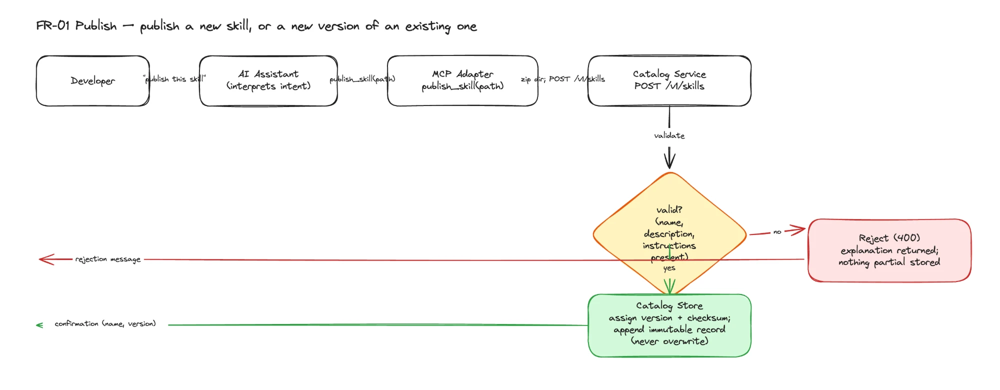
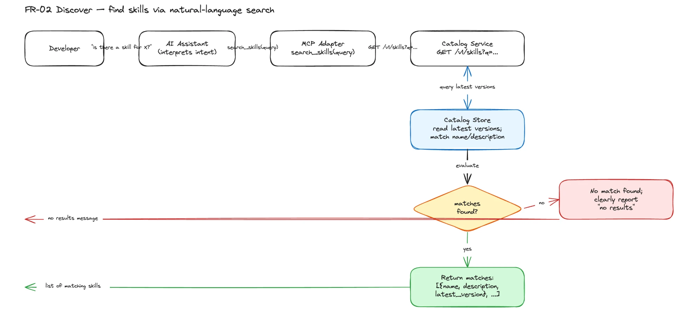
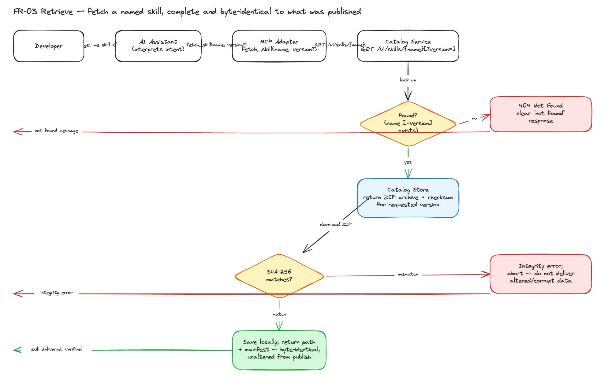
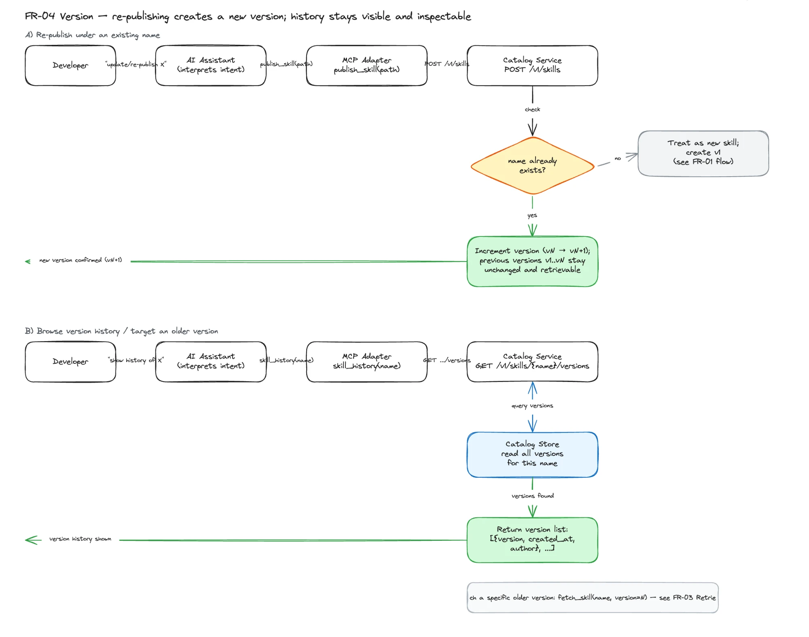
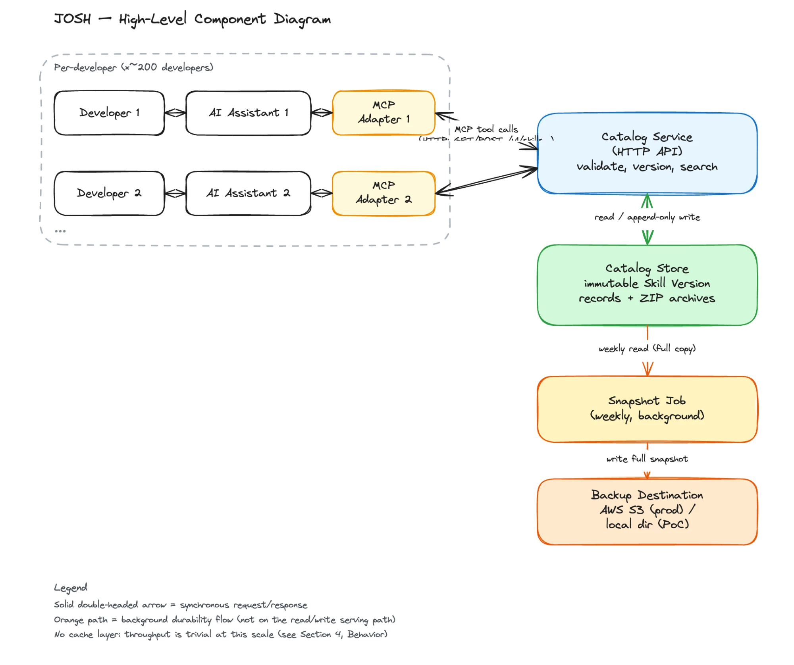

# System Design: JOSH(Just Our Skills Hub)

_A central hub of skills catalog_

---

## 1. Assumptions

- Developers reach the catalog exclusively through an AI assistant acting on natural-language intent — no requirement for a direct human-operated UI (PRD 9).
- The skill format (manifest + optional supporting files) is sufficient for what developers want to share — no need to support other artifact types (PRD 9).
- A trusted set of developers; no authentication/access control needed (PRD 8, D3).
- No numeric SLOs — "fast enough to feel interactive" is qualitative, not a hard target (PRD 7).
- Self-contained: must run on a reviewer's machine from a short README, no external infra dependency (PRD 9).
- System is intended for a developer team size of ~200 developers.
- "Reviewer's machine" = single-machine PoC — the catalog is simulated as a local service reachable by one or more assistant sessions on the same machine, not deployed across real separate developer machines/network.
- Skill names are the identity/versioning key — publishing under an existing name creates a new version (PRD UC-04); name is effectively unique per skill.
- No concurrent-write conflict handling — small trusted group, no need for optimistic locking or merge conflict resolution on simultaneous publishes to the same name.
- Skills are small, text-based artifacts (manifest + a handful of small supporting files), not large binaries.
- This design targets Phase 1 (MVP) only: FR-01 Publish, FR-02 Discover, FR-03 Retrieve, FR-04 Version. Phase 2 and out-of-scope items (auth, de-duplication) are excluded (PRD 11, 8).

---

## 2. Outline Approach

- **Define Scale:** Bound by team size (~200 devs), not DAU/MAU traffic modeling.
- **Derive math:** Skip capacity-planning math — not needed at this scale.
- **Design system:** Concentrate design effort on the real complexity for this exercise — the data model (skill/manifest/version), the versioning behavior (FR-04), the API surface (FR-01–03), and how an AI assistant reaches the catalog (the PRD's core open dependency, PRD §10) — since that's where the actual decisions live, not in scale math.

---

## 3. Scope

**In scope:**
- Publish a skill (manifest + supporting files) to the catalog (FR-01)
- Discover skills via natural-language query through an AI assistant (FR-02)
- Retrieve a named skill, complete and unchanged (FR-03)
- Version skills — re-publish under an existing name creates a new version; latest is default, specific versions retrievable, history visible (FR-04)
- Reject malformed publishes (missing name/description/body) cleanly, no partial writes

**Out of scope:**
- Authentication / access control (PRD §8, D3)
- De-duplication of similar/near-identical skills (PRD §8, D3)
- Phase 2 additions (undefined, deferred to builder's judgment — PRD §11)
- A direct human-operated UI as the access path (assistant-mediated only, per Assumptions)
- Multi-machine/networked deployment across real separate developer machines (single-machine PoC, per Assumptions)
- Concurrent-write conflict resolution / locking (per Assumptions)

**NFRs:**
- Latency: fast enough to feel interactive within an assistant conversation — no numeric target (PRD §7)
- Availability: not a stated concern — single-machine PoC, no HA requirement
- Consistency: a retrieved skill must be complete and unchanged from what was published — no silent loss or alteration (PRD §7)

**System type:** Versioned artifact/metadata store with natural-language search, exposed to AI assistants as callable tools (not a distributed system)

---

## 4. Behavior

| Action | Per User/Day | Total/Day |
|---|---|---|
| Publish (new skill or new version) | ~0.33 (≈1 every 3 days) | ~67 |
| Discover (search) | 10 | ~2,000 |
| Retrieve (fetch by name) | 5 | ~1,000 |

- Read:Write ratio ≈ 45:1 (discover + retrieve vs. publish) — heavily read-dominated
- Peak multiplier: ~2–3x during working hours (internal dev tool, not 24/7 global traffic); absolute peak is still modest (~125–190 requests/hour) — no caching/sharding needed for throughput
- Durability: low write volume ≠ low durability need — a lost publish is a lost skill for the whole team, so data must still be replicated/backed up even though the *rate* of writes never demands it

---

## 5. Data

**Skill Version fields:**
| Field | Description | Size |
|---|---|---|
| `name` | Unique identifier for the skill; used as the versioning key (same name = new version, not a new skill) | ~50 B |
| `description` | Short human-readable summary used for natural-language discovery/search matching | ~200 B |
| `author` | Name of the developer who published this version | ~50 B |
| `instructions` | The manifest's instruction body — the actual reusable AI-assistant instructions | ~5 KB |
| `files` | Supporting files bundled with the skill (filename + content pairs), 0–N | ~10 KB (avg, variable) |
| `version` | Monotonically increasing version number for this skill name | ~4 B |
| `created_at` | Timestamp this version was published | ~8 B |
| `checksum` | SHA-256 digest of the archive, computed at publish time; lets `fetch_skill` verify it received the exact, unaltered version | ~64 B (hex-encoded) |
| **Total** | | **~15 KB** |

**Dominant field:** `files` (when present) / `instructions` — the metadata fields (`name`, `description`, `author`, `version`, `created_at`, `checksum`) are negligible by comparison; storage sizing should be driven by content size, not row count.

---

## 6. Retention

- All versions of every skill are retained indefinitely — no pruning/expiration. Deleting a version would violate the "no silent loss" consistency requirement (PRD §7) and defeats the purpose of version history (FR-04).
- No hot/warm/cold tiering — data volume is trivial at this scale (~67 publishes/day × ~15 KB ≈ ~1 MB/day, ~365 MB/year), so there's no cost or performance reason to move older versions to cheaper storage.
- Storage: unbounded (grows with skill/version count), but growth rate is negligible at 200-developer scale — even a decade of history stays well under a few GB.
- Durability over recency: publishes are rare but each is valuable (a lost skill affects the whole team), so the retention priority is "never lose a version," not "keep only recent data hot/accessible."

- Durability design: weekly full snapshots.
  - **Frequency:** Weekly full snapshot of the entire catalog store (all skills, all versions, metadata + files).
  - **Destination:** AWS S3 in production — durable, cheap, standard choice for infrequent-access backups at this data volume. For the Phase 1/2 PoC, snapshots write to a local directory instead (swappable for S3 later), so the reviewer's machine stays fully offline-runnable per the self-contained Assumption.
  - **Purpose:** Durability only. Snapshots are not a serving path — no querying, indexing, or reads from the snapshot during normal discover/retrieve. Their only job is disaster recovery.
  - **Content:** Full copy, not incremental — at ~1 MB/day growth (~7 MB/week), a full weekly snapshot is trivially cheap; incremental/diff snapshotting would add complexity with no real benefit at this scale.
  - **Snapshot retention:** Keep all weekly snapshots (or a simple lifecycle rule to move old snapshots to cold storage after N months) — a separate concern from catalog version retention (the catalog itself never deletes a version, regardless of snapshot policy).
  - **Recovery model:** Manual/operator-triggered restore from the latest snapshot if primary storage is lost — not automated failover, consistent with the "no HA requirement" NFR (Section 3).

---

## 7. High Level Design

**Request flow:**
```
Developer → AI Assistant (interprets natural-language intent, calls MCP tools)
          → MCP Adapter (4 tools: search_skills, fetch_skill, skill_history, publish_skill)
          → Catalog Service (HTTP API — validation, versioning, search)
          → Catalog Store (immutable Skill Version archives + metadata)

search_skills(query)     → GET  /v1/skills?q=...              → [{name, description, latest_version}, ...]
fetch_skill(name, ver?)  → GET  /v1/skills/{name}[?version=]  → download ZIP, verify SHA-256, return local path + manifest
skill_history(name)      → GET  /v1/skills/{name}/versions    → [{version, created_at, author}, ...]
publish_skill(path)      → POST /v1/skills                    → zip directory, upload; catalog assigns version + checksum
```

**Skill package format** (what gets zipped/stored per version):
```
release-note-draft/
  SKILL.md              # YAML front matter: name, description; Markdown body = instructions
  templates/
    release.md           # supporting file

release-note-draft/v1/   # as persisted by the Catalog Service (not developer-authored)
  SKILL.md
  templates/release.md
  .catalog-meta.json     # { author, version, created_at, checksum } — attached at publish time
```

**Major components:**
- **AI Assistant (client)** — not part of this system; calls MCP tools on the developer's behalf (PRD §10 dependency)
- **MCP Adapter** — runs beside each developer's assistant; exposes `search_skills` / `fetch_skill` / `skill_history` / `publish_skill` as MCP tools, translating them into HTTP calls against the Catalog Service. This is the swappable "access layer" the PRD leaves to the builder.
- **Catalog Service (HTTP API)** — core logic: validates publishes, assigns version + checksum, enforces immutability (append-only, never overwrite), matches discovery queries, resolves version lookups. Stores/serves each Skill Version as a ZIP archive.
- **Catalog Store (DB)** — persists Skill Version records (metadata) and archive blobs as an immutable, append-only log; SQL vs NoSQL choice in Section 8
- **Snapshot Job** — periodic (weekly) background process writing full catalog snapshots to a local directory / S3, per Section 6

**Integrity guarantee:** `fetch_skill` downloads the exact archive published and verifies its SHA-256 before returning it — the assistant never recreates, summarizes, or alters a skill; it only ever hands back a byte-identical, previously-published version. This directly satisfies the Consistency NFR (Section 3).

No cache layer — throughput is trivial at this scale (Section 4).

**Flow diagrams:**

FR-01 Publish Flow


FR-02 Discover flow


FR-03 Retrieve flow


FR-04 Version flow


High-Level Component Diagram



---

## 8. Component Deep Dive

### Hardest component: MCP Adapter (assistant-to-catalog access layer)

**Problem:** The PRD leaves "how the assistant reaches the catalog" entirely to the builder (PRD §10) — this is the system's core open dependency. A bespoke integration per assistant vendor doesn't scale, and a plain CLI requires the assistant to correctly construct shell invocations from natural language rather than making structured, typed calls.

**Options:**

| | A: MCP server | B: Plain CLI | C: Custom per-vendor function-calling |
|---|---|---|---|
| Portability | High — any MCP-compatible assistant, growing ecosystem standard | Medium — needs shell/tool-execution capability, not uniformly available | Low — locked to one assistant/vendor |
| Reliability | High — typed tool schema constrains inputs, fewer malformed calls | Medium/Low — assistant must construct correct CLI syntax from NL | High — fully controlled schema |
| Effort | Low/Medium — one adapter, reusable across assistants | Low — simple, familiar tooling | High — re-implemented per vendor |

**Decision:** MCP server (Option A) — best portability/reliability tradeoff, matches the assistant-mediated-access Assumption without vendor lock-in, and is what Sections 7/8 already assume (`search_skills` / `fetch_skill` / `skill_history` / `publish_skill`).

**Implementation details:**
- Runs as a local MCP server over stdio, launched as a subprocess by the developer's assistant (standard MCP pattern) — no network exposure beyond its own localhost calls to the Catalog Service.
- Built with the official MCP SDK — Python, TypeScript, or Java all have official SDKs; kept as a thin translation layer only, all business logic stays in the Catalog Service.
- Catalog Service base URL is configurable (env var, defaults to `http://localhost:<port>` for the PoC).
- `fetch_skill` caches downloaded archives locally by `name/version/checksum`, so repeated fetches in a session don't re-download unchanged content.
- Errors map to clear tool-result messages, not raw HTTP responses/stack traces — e.g. 404 → "not found", 400 → validation explanation — matching the PRD's exception requirements (UC-02/UC-03).
- `publish_skill` validates the local directory has a `SKILL.md` before calling the server (fail fast locally); final validation is still authoritative server-side.

---

### Catalog Service (HTTP API — business logic)

**Problem:** Needs to run the actual validation/versioning/search logic, but must stay easy enough that a reviewer can start the whole system from a short README with no infra setup (self-contained Assumption).

**Options:**

| | A: Single-process lightweight HTTP server | B: Multi-process/service framework | C: Serverless (Lambda + API Gateway) |
|---|---|---|---|
| Setup effort (reviewer's machine) | Low — one process, one command | High — multiple processes/config | High — cloud account/deploy step |
| Matches self-contained Assumption | Yes | Partially | No — external cloud dependency |
| Production headroom | Adequate — same code can scale later if needed | High (unneeded at this scale) | High (unneeded at this scale) |

**Decision:** Single-process lightweight HTTP server (A) — matches the self-contained Assumption and Section 4's trivial-throughput conclusion; B and C add operational complexity this exercise doesn't need.

---

### Catalog Store (deployment topology — embedded vs. standalone)

**Problem:** The SQL vs NoSQL Decision below settles the data model shape (SQLite + filesystem blobs). The separate question here is deployment topology — embedded in-process, or a standalone DB server?

**Options:**

| | A: Embedded SQLite file | B: Standalone DB server (Postgres) | C: Managed cloud DB (RDS) |
|---|---|---|---|
| Setup effort | None — a file on disk | Medium — separate install/process | High — cloud account, network |
| Matches self-contained Assumption | Yes | No | No |
| Needed at 200-dev, ~15 KB/row scale? | More than sufficient | Overkill | Overkill |

**Decision:** Embedded SQLite (A). If the system ever moved beyond single-machine (out of scope per Assumptions), Postgres is the natural swap — same relational shape, no schema redesign.

---

### Snapshot Job (scheduling mechanism)

**Problem:** The weekly snapshot needs a trigger that runs reliably without an always-on scheduling service, and without a cloud dependency for the PoC.

**Options:**

| | A: OS-level cron | B: In-process scheduler (timer thread in Catalog Service) | C: Cloud-native scheduler (EventBridge) |
|---|---|---|---|
| Depends on Catalog Service staying up | No — decoupled | Yes — missed if service is down | No — decoupled |
| Matches self-contained Assumption | Yes | Yes | No — external cloud dependency |
| Production-realistic | Yes — cron is a standard prod pattern too | Less — fragile scheduling model | Yes |

**Decision:** OS-level cron invoking a standalone snapshot script (A) — decoupled from the service process, no extra runtime dependency. Production would swap to a cloud-native scheduler (C) alongside real S3, mirroring the same PoC/prod substitution already made for storage (Section 6).

---

### Backup Destination (where snapshots are written)

**Problem:** Snapshots need a destination durable enough to survive loss of the primary Catalog Store, while the PoC stays fully offline-runnable.

**Options:**

| | A: AWS S3 | B: Local directory / second disk | C: Other cloud object store (GCS, Azure Blob) |
|---|---|---|---|
| Durability | Very high (11 nines) | Low — same machine, no protection against machine-level loss | Very high |
| Matches self-contained Assumption | No — needs AWS account/network | Yes | No |
| Reason to prefer | Industry-standard, cheap at this volume | Simplicity for PoC | No stated preference in PRD/Assumptions |

**Decision:** AWS S3 (A) is the production target (per Section 6); local directory (B) is the PoC substitution. No reason to introduce Option C — nothing favors it over S3.

---

### API Design

```
POST /v1/skills                          publish archive
GET  /v1/skills?q=release+notes          search latest versions
GET  /v1/skills/{name}                   download latest archive
GET  /v1/skills/{name}?version=1         download an older archive
GET  /v1/skills/{name}/versions          list version history
```

No `PUT`/`DELETE` — the catalog is append-only (Section 6): publishing under an existing `name` always creates a new version via `POST`, and nothing is ever updated or removed in place.

MCP tools wrap these endpoints for the assistant:
- `search_skills(query)` — returns name, description, and latest version
- `fetch_skill(name, version?)` — downloads the complete ZIP, verifies its SHA-256, returns the local archive path plus its manifest
- `skill_history(name)` — returns retained versions
- `publish_skill(path)` — optional convenience tool; a CLI can also publish directly against the HTTP API

---

### SQL vs NoSQL Decision

| Store | Choice | Reason |
|---|---|---|
| Skill Version metadata (name, description, author, version, created_at, checksum) | SQL (SQLite) | Relational by nature — one name has many versions; needs "latest version for name" / "all versions for name" queries. Trivial row count at 200-dev scale; SQLite needs no server process, fitting the self-contained/offline-runnable Assumption. |
| Skill archive blobs (ZIP files) | Filesystem | Opaque immutable byte blobs, not queried — access pattern is a direct lookup by name+version, not a query. Storing large blobs in DB rows is an anti-pattern; flat files are simpler and mirror cleanly into the weekly snapshot (Section 6). |
| Discovery/search index (match query against name/description) | SQL (SQLite FTS5) | Corpus is small (low hundreds/thousands of skills, ~2,000 discover calls/day) — a lightweight full-text extension on the same SQLite DB is sufficient. A dedicated search engine or vector DB would be over-engineering for this scale/exercise. |

---

## 9. Tradeoffs

**Durability vs. Complexity/Cost:**
- Weekly snapshots accept up to ~7 days of possible data loss (RPO) instead of real-time replication — fine given publish volume is tiny (~67/day).
- Never deleting a version trades unbounded storage for zero risk of losing history — cheap tradeoff at ~365 MB/year growth.

**Simplicity (PoC) vs. Production-readiness:**
- Every Section 8 choice (SQLite, local dir, OS cron, single-process server) picked the simpler offline-runnable option over its production counterpart (Postgres, S3, cloud scheduler), with the swap noted at each point.
- No caching/sharding — traded away scale headroom that isn't needed at this load (Section 4).

---

## 10. Summary

| Decision | Choice |
|---|---|
|  |  |
|  |  |
|  |  |
