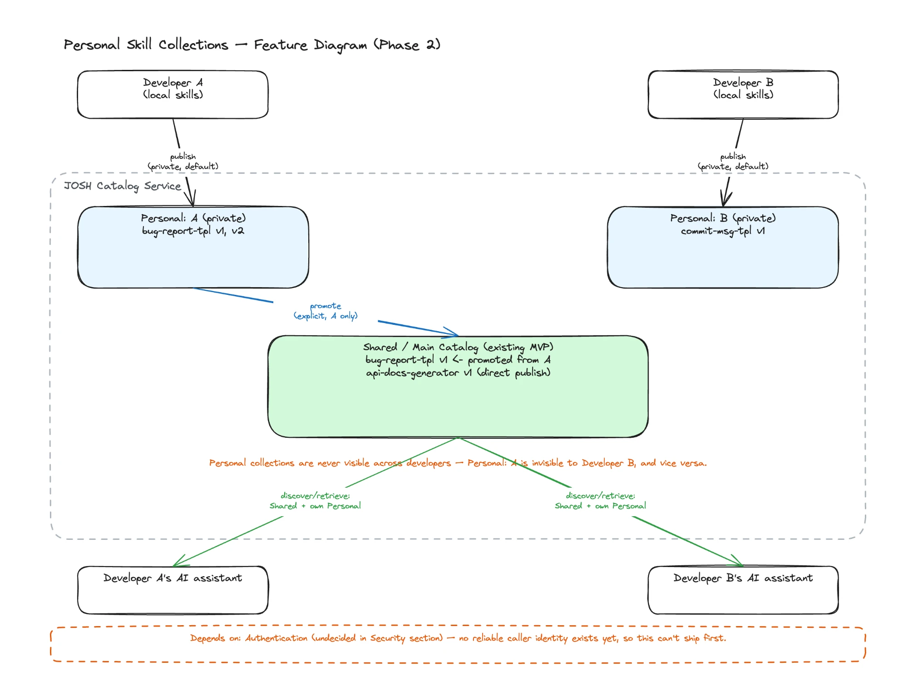

# Phase 2: Improvement Roadmap

_Improvements to JOSH identified after Phase 1 (MVP) shipped to `main`, organized by area. This is a backlog, not a build order — each item still needs its own design discussion before implementation._

---

## 1. Immediate Fixes

Small, high-value corrections found during Phase 1 implementation and testing.

- **Concurrent publish of a new skill name fails ungracefully.** The `UNIQUE(name, version)` constraint protects data integrity, but a simultaneous double-publish under the same new name currently surfaces as a raw SQL exception (500), not a clean "already published, please retry" response.
  - **Fixed:** the losing publish now gets a clean 409 with a retry message instead of a raw 500, verified with two genuinely concurrent live requests. [60ae3bf](https://github.com/hguochen/josh/commit/60ae3bf)
- **No upload size limit is enforced.** Assumption 18 (`phase1_design_specifications.md`) states skills are small, text-based artifacts, but nothing in the stack actually enforces that — a large upload would be silently accepted.
  - **Fixed:** capped uploads at 5MB, rejected with a clean 400 instead of a silent accept or a raw 500. [dea5c67](https://github.com/hguochen/josh/commit/dea5c67)

---

## 2. Scalability

- **High availability was explicitly deferred for Phase 1.** Revisit now that the MVP has shipped — decide whether it's still out of scope or becomes a Phase 2 target.
  - Active-passive: 1 active node serving requests, 1 passive on standby, automatic failover.
  - Passive needs the same data — SQLite is a single file, so replicate it (e.g. WAL streaming) or use shared storage, not a local disk per node.
  - virtual IP in front, routing only to the current active node.
  - Interval health checks to detect the active node is down and trigger failover.
  - A lock/lease so only one node ever writes at a time — avoids split-brain, matches SQLite's single-writer model.
- **No pagination on `discover` / version-history endpoints.** Fine today; will break down as individual skills accumulate many versions or the catalog grows well past current assumptions.
  - Add `limit`/`cursor` query params with a sane default and a hard max, instead of always returning the full result set.
  - Cursor-based (keyset), not offset — offset pagination skips/duplicates rows as new versions get published concurrently.
  - Version-history can cursor on `version` itself — already monotonic per skill name.
  - Response should carry a `next_cursor` (or similar) so callers know whether more pages exist. Similar to HATEOAS implementation for REST services.

---

## 3. Security

- **Authentication was explicitly out of scope for Phase 1** (trusted small group, PRD 8/D3). Needs a deliberate decision for Phase 2 — stay open, or add access control — rather than remaining unaddressed by default.
  - Simplest option: per-developer API key/token, issued out of band, checked by a filter/interceptor in catalog-service.
  - If an existing corporate SSO is available, prefer OAuth2 over rolling a custom scheme.

- **No rate limiting or abuse protection** beyond the informal usage assumptions in Section 1 of the Phase 1 design (10 discovers/day, 5 retrieves/day, 1 publish/3 days per developer) — those are capacity assumptions, not enforced limits.
  - Enforce those same numbers with a simple per-developer rate limiter (e.g. bucket4j), keyed by author/token.
  - Return 429 with a clear message when exceeded, matching the existing clean-error pattern.
  - Enforce centrally in catalog-service, not per-client — it's the one choke point every caller (MCP adapter, curl, future CLI) goes through.

---

## 4. Observability

- **No structured logging of publish/discover/retrieve events.** Makes debugging and usage analysis difficult beyond default Spring Boot request logs.
  - Log each call as structured (JSON) output: skill name, version, author/caller, outcome, latency — not free-text.
  - Add a correlation/request ID so one call's logs are traceable across catalog-service and the MCP adapter.
  - SLF4J/Logback with a JSON encoder covers this — no new infra needed.
- **Snapshot job can fail silently.** It runs via OS cron with no alerting — a failed run currently has no signal beyond a non-zero exit code nobody is watching.
  - Alert on failure — simplest: cron mails on non-zero exit, or wrap the job in a script that notifies Slack/email.
  - Write a "last successful snapshot" timestamp file; alert if it goes stale, so a job that silently stops running (not just one that fails) is also caught.

- **No health/metrics endpoint** on the catalog service for operational visibility.
  - Add Spring Boot Actuator (`/actuator/health`, `/actuator/metrics`) — minimal effort, built-in.
  - Health check should confirm the SQLite file is actually reachable/writable, not just "process is up."
  - Expose basic counters (publishes/discovers/retrieves, skill count) — cheap way to validate against the Section 1 capacity assumptions.

---

## 5. Features

- **Per-developer private skill collections, promotable to the shared catalog.** A two-tier catalog: publishing defaults to a private, developer-scoped space visible only to the publisher; an explicit "promote" action moves a skill into the existing shared catalog (today's MVP behavior, unchanged). Closer to a private fork than a local repo — skills stay server-hosted throughout, only visibility changes.
  - Data model: add a `scope` column to `skill_versions`; widen `UNIQUE(name, version)` to `UNIQUE(scope, name, version)` — no new database, no schema fork. `scope` is `"shared"` for the main catalog, or the developer's identity for personal.
  - `discover`/`retrieve` become identity-scoped: results are shared skills ∪ the caller's own personal skills, never another developer's personal skills. Retrieve of someone else's personal skill should 404, not 403 — don't leak that it exists.
  - MCP Adapter needs to carry the caller's identity on every call so the Catalog Service can enforce the above.
  - **Hard dependency: requires Authentication**, which is currently undecided in the Security section — there's no reliable caller identity today (`author` is an unverified free-text string).
  - Personal skills stay append-only/immutable, same as shared — no delete/unshare (Section 6).
  - Open question — promote conflict policy: what happens when the promoted name already exists in shared?
  - Open question — version lineage on promote: does the full personal history (e.g. v1–v3) become visible in shared, or does shared start fresh at v1?
  - Open question — ownership after promotion: does the promoting developer become the owner (gating who can publish future shared versions), or does it stay open like today?

